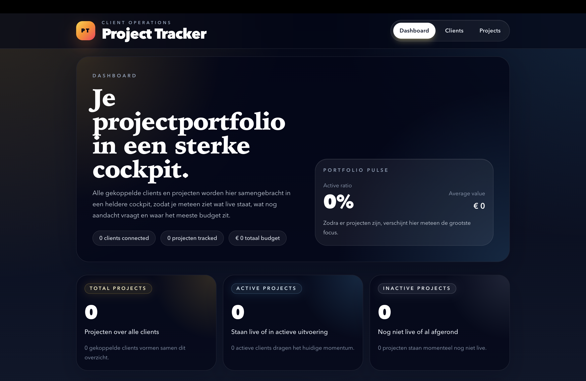
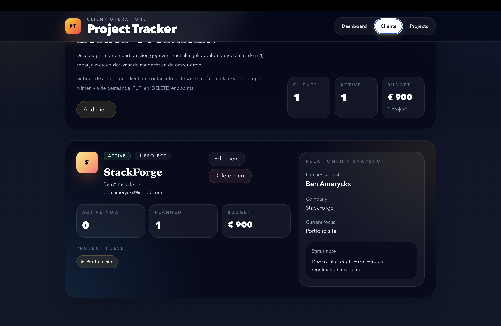
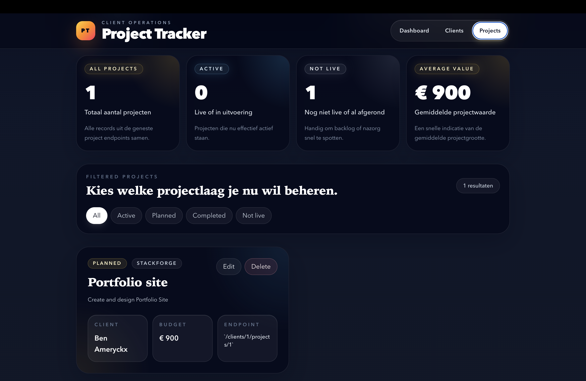
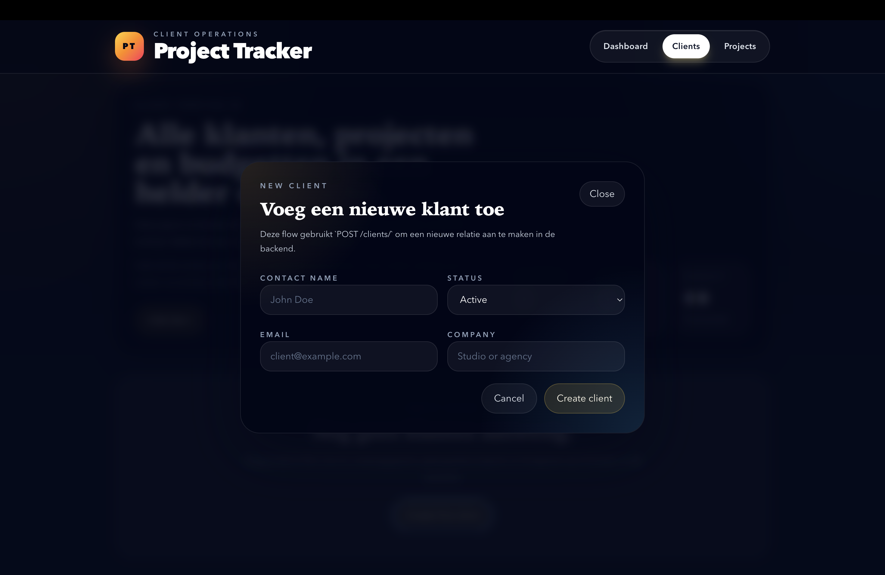
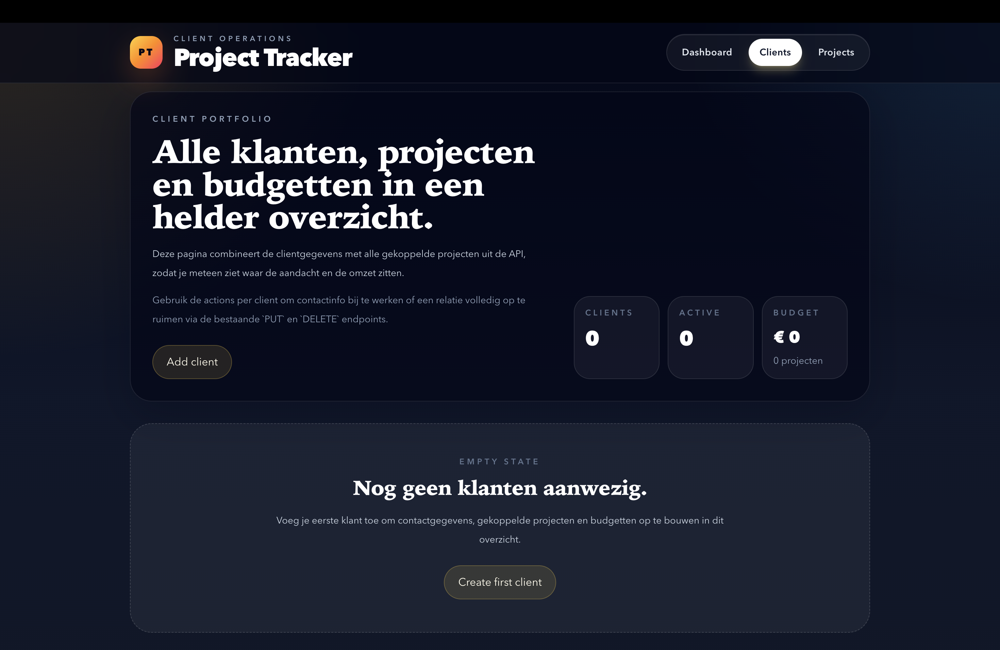

# 🚀 Project Tracker

[](https://project-tracker.benameryckx.be)


🔗 **Live demo:** https://project-tracker.benameryckx.be

---

## 📌 Over het project

Project Tracker is een **production-ready fullstack webapplicatie** waarmee je klanten en hun projecten kan beheren.

De applicatie laat toe om klanten aan te maken, te bewerken en te verwijderen, en per klant meerdere projecten te beheren met status en budget.

Dit project werd volledig van scratch opgebouwd met focus op:

- duidelijke architectuur
- realistische use-case
- production-ready deployment

---

## ✨ Features

### 👤 Client management

- Nieuwe klanten aanmaken
- Klanten bewerken en verwijderen
- Unieke e-mailvalidatie
- Statusbeheer (active, inactive, pending)

### 📁 Project management

- Projecten per klant beheren
- Budget en status per project
- Volledige CRUD operaties

### 📊 Dashboard

- Overzicht van klanten en projecten
- Statistieken (aantal klanten, projecten, budget)
- Filtering op status

### 🎯 UX & UI

- Responsive design
- Empty states (geen data, filters, afhankelijkheden)
- Error handling
- Success feedback (bv. na delete)
- Modals voor create/update flows

---

## 🧠 Technische stack

### Frontend

- React (Vite)
- Custom hooks (data fetching)
- Fetch API (custom request wrapper)
- Tailwind CSS
- Component-based architecture

### Backend

- FastAPI
- SQLAlchemy (ORM)
- SQLite database
- REST API (nested resources)

### DevOps / Deployment

- Uvicorn (ASGI server)
- systemd (process management)
- Nginx (reverse proxy + static hosting)
- Certbot (HTTPS/SSL)

---

## 🏗️ Architectuur

```txt
React Frontend
      ↓
Nginx (static + proxy /api)
      ↓
FastAPI (Uvicorn)
      ↓
SQLite Database
```

Frontend en backend communiceren via:

```txt
/api/clients/
/api/clients/{id}/projects/
```

---

## ⚙️ Highlights

- Custom API service layer met centrale error handling
- Data compositie (clients + projecten per client)
- Full CRUD functionaliteit
- Nested resources (clients → projects)
- Real-world UX flows (empty states, feedback, filters)

---

## 🐛 Problemen & oplossingen

### ❌ Trailing slash bug (FastAPI)

API endpoints met en zonder `/` zorgden voor redirects en parsing issues.

✅ Oplossing:

- consistente trailing slashes in frontend API calls

---

### ❌ SQLite path probleem (deployment)

Database kon niet geopend worden op server.

✅ Oplossing:

- correcte absolute path
- juiste folderstructuur (`/data`)

---

### ❌ Relative imports FastAPI

Werkte lokaal maar faalde op server.

✅ Oplossing:

- app starten als package (`module:app`)
- correcte projectstructuur

---

### ❌ Nginx proxy issues

Frontend kon API niet bereiken.

✅ Oplossing:

- correcte `/api` proxy setup
- consistente routes

---

## 🚀 Deployment

De applicatie draait op een **eigen Linux server**:

- Frontend build gehost via Nginx
- Backend draait via systemd service
- API bereikbaar via `/api`
- HTTPS via Certbot

---

## 📸 Screenshots

### 🏠 Dashboard

Overzicht van alle klanten, projecten en budgetten in één centrale cockpit.



---

### 👤 Clients overzicht

Beheer van klanten met gekoppelde projecten en statussen.



---

### 📁 Projects overzicht

Projecten gegroepeerd en filterbaar per status.



---

### ✨ Modals (Create / Update)

Gebruiksvriendelijke modals voor create/update flows.



---

### 📭 Empty states

Duidelijke feedback wanneer er nog geen data beschikbaar is.



---

## 🎯 Wat ik geleerd heb

- Fullstack applicaties bouwen van scratch
- API design en structuur met FastAPI
- Data flow tussen frontend en backend
- Deployment op eigen server (Nginx, systemd, HTTPS)
- Debuggen van real-world problemen
- UX denken (empty states, feedback, flows)

---

## 🔮 Mogelijke uitbreidingen

- 🔐 Authenticatie (login/register)
- 🗄️ Migratie naar PostgreSQL
- ⚡ React Query voor data management
- 📈 Geavanceerde dashboard statistieken
- 🧪 Unit & integration testing

---

## 💬 Conclusie

Dit project toont mijn vermogen om:

- een volledige applicatie te bouwen
- problemen zelfstandig op te lossen
- een productieklare setup op te zetten

👉 Van idee → tot live applicatie 🚀
